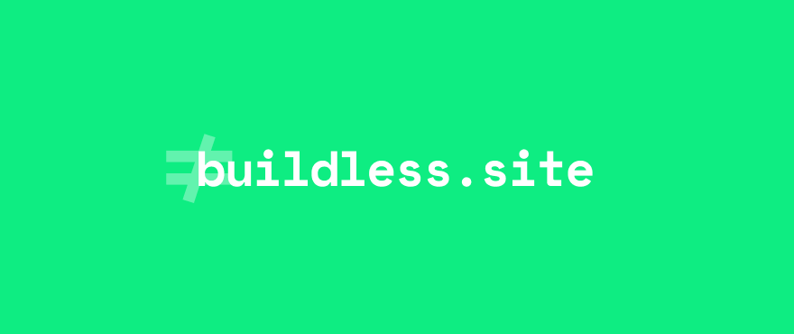

[](https://fresh.deno.dev)


[](https://deno.land/x/fresh)
[](#)
[](https://twitter.com/hwclass)

A collection of sites, apps, packages, articles and other stuff about ES
modules.

Please go & check
[awesome-buildless](https://github.com/hwclass/awesome-buildless) for the
content as an awesome list.

### 🏠 [Homepage](https://buildless.site)

## Prerequisites

- You will need Deno installed on your system:

[Instal from here](https://deno.land/manual@v1.28.1/getting_started/installation)

## Development

- Create a `.env` file in the main directory by duplicating from the
  .env.example:

```env
SNOWPACK_PUBLIC_GLITCH_BOILERPLATE_URL="https://glitch.com/~buildless-boilerplate"
SECTIONS_API_ENDPOINT="http://localhost:3000/api/sections"
```

Run (with PRODUCTION=false flag):

```sh
deno task dev
```

Run (with production):

```sh
deno task start
```

## Application

Once the app and the API begin running, go hit the main page over
http://localhost:8000.

### Fetch sections

`/api/sections` [GET] : returns the following payload from
[awesome-buildless](https://github.com/hwclass/awesome-buildless) repo:

```json
{
  "sections": [
    {
      "title": "Articles",
      "list": [
        {
          "content": "Going Buildless",
          "href": "https://dev.to/open-wc/on-the-bleeding-edge-3cb8"
        }
      ]
    },
    {
      "title": "Tutorials",
      "list": [
        {
          "content": "Developing without a Build (1)",
          "href": "https://dev.to/open-wc/developing-without-a-build-1-introduction-26ao"
        }
      ]
    },
    {
      "title": "Tools &amp; Platforms",
      "list": [{ "content": "Pika", "href": "pika.dev" }]
    },
    {
      "title": "Packages &amp; Libraries",
      "list": [
        {
          "content": "es-dev-server",
          "href": "https://www.npmjs.com/package/es-dev-server"
        }
      ]
    }
  ]
}
```

## Tech Stack

- [deno](https://deno.land/)
- [fresh](https://fresh.deno.dev/)
- [preact](https://preactjs.com/)
- [svg backgrounds](https://www.svgbackgrounds.com)

## Authors

👤 **hwclass**

- [Web](https://hwclass.dev)
- [Twitter](https://twitter.com/hwclass)
- [Github](https://github.com/hwclass)
- [LinkedIn](https://linkedin.com/in/hwclass)

👤 **Kjaer**

- [Web](https://medium.com/@kjaer)
- [Twitter](https://twitter.com/halilkayer)
- [Github](https://github.com/Kjaer)
- [LinkedIn](https://linkedin.com/in/halilkayer)

## Licence

ISC
