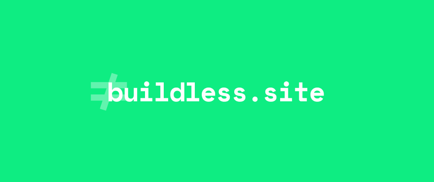
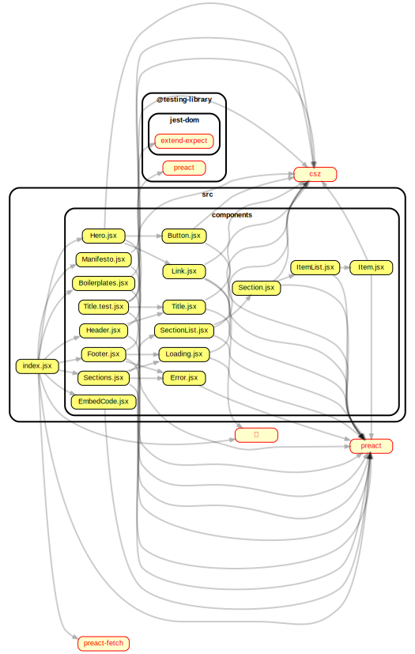

  [  ](#) [](https://twitter.com/hwclass)

A collection of sites, apps, packages, articles and other stuff about ES modules.

Please go & check [awesome-buildless](https://github.com/hwclass/awesome-buildless) for the content as an awesome list.

### 🏠 [Homepage](https://buildless.site)

## Prerequisites

- Set your Node.js version as 14 as minimum:

```sh
nvm use 16 # will set the local Node.js as 16.x if installed via nvm
# if not, please visit https://github.com/nvm-sh/nvm#install--update-script, then
nvm install 16
```

## Development

- Create a `.env` file in the main directory by duplicating from the .env.example:

```env
SNOWPACK_PUBLIC_API_TOOLS="http://localhost:3000/api/tools"
SNOWPACK_PUBLIC_GLITCH_BOILERPLATE_URL="https://glitch.com/~buildless-boilerplate"
SNOWPACK_PUBLIC_API_SECTION="http://localhost:3000/api/sections"
```

Install:

```sh
npm install
```

From your terminal:

```sh
make start
```

This starts your client app & api in development mode, rebuilding assets on file changes.

Note: Since everytime when somethinng changes in the code, `npm run build` is triggered via vercel & this also causes another (p)react re-render via `@prefresh/snowpack` which triggers an endless refresh loop. This should be fixed in the other updates.

You can update the dependency graph with the following commands:

```sh
npm i -g dependency-cruiser
depcruise --exclude "^node_modules" --output-type dot src | dot -T svg > dependencygraph.svg
```

## Component Dependency Graph



## Application

Once the client app and the API runs, go into the main page (ideally http://localhost:8000).

### Fetch sections

`/api/sections` [GET] : returns the following payload from [awesome-buildless](https://github.com/hwclass/awesome-buildless) repo:

```json
{
  "sections": [
    {
      "title": "Articles",
      "list": [
        {
          "content": "Going Buildless",
          "href": "https://dev.to/open-wc/on-the-bleeding-edge-3cb8"
        }
      ]
    },
    {
      "title": "Tutorials",
      "list": [
        {
          "content": "Developing without a Build (1)",
          "href": "https://dev.to/open-wc/developing-without-a-build-1-introduction-26ao"
        }
      ]
    },
    {
      "title": "Tools &amp; Platforms",
      "list": [{ "content": "Pika", "href": "pika.dev" }]
    },
    {
      "title": "Packages &amp; Libraries",
      "list": [
        {
          "content": "es-dev-server",
          "href": "https://www.npmjs.com/package/es-dev-server"
        }
      ]
    }
  ]
}
```

`/api/tools` [GET] : returns the following payload from [api/tools/index.js](https://github.com/hwclass/buildless-site/blob/master/api/tools/index.js#L12):

```json
[
  {
    "title": "browserslist",
    "link": "https://github.com/browserslist/browserslist",
  },
  {
    "title": "csz",
    "link": "https://github.com/lukejacksonn/csz",
  },
  {
    "title": "htm',
    "link": "https://github.com/developit/htm",
  },
  {
    "title": "husky',
    "link": "https://github.com/typicode/husky",
  },
  {
    "title": "zeit now',
    "link": "https://zeit.co/",
  },
  {
    "title": "snowpack',
    "link": "https://www.snowpack.dev/",
  },
  {
    "title": "preact',
    "link": "https://preactjs.com/",
  },
  {
    "title": "preact-fetch',
    "link": "https://www.pika.dev/npm/preact-fetch",
  },
  {
    "title": "prettier',
    "link": "https://prettier.io/",
  },
  {
    "title": "pretty-quick',
    "link": "https://www.npmjs.com/package/pretty-quick",
  },
  {
    "title": "svg backgrounds',
    "link": "https://www.svgbackgrounds.com",
  }
]
```

## Tech Stack

- [snowpack](https://www.snowpack.dev/)
- [preact](https://preactjs.com/)
- [preact-fetch](https://www.pika.dev/npm/preact-fetch)
- [htm](https://github.com/developit/htm)
- [marked](https://www.npmjs.com/package/marked)
- [svg backgrounds](https://www.svgbackgrounds.com)

## Authors

👤 **hwclass**

- [Web](https://hwclass.dev)
- [Twitter](https://twitter.com/hwclass)
- [Github](https://github.com/hwclass)
- [LinkedIn](https://linkedin.com/in/hwclass)

👤 **Kjaer**

- [Web](https://medium.com/@kjaer)
- [Twitter](https://twitter.com/halilkayer)
- [Github](https://github.com/Kjaer)
- [LinkedIn](https://linkedin.com/in/halilkayer)

## Licence

ISC
